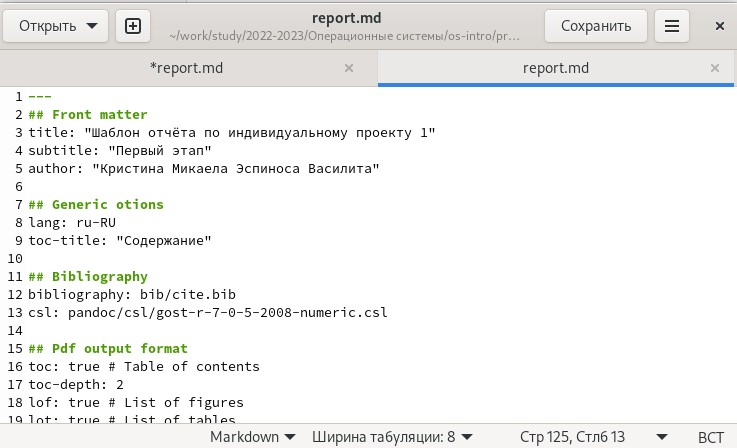
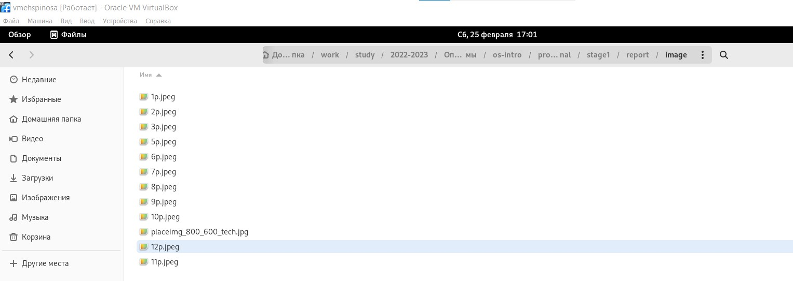
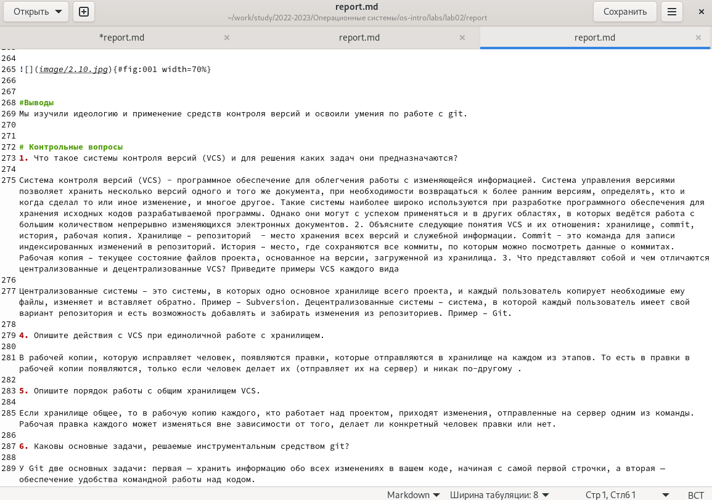

---
## Front matter
title: "Шаблон отчёта по лабораторной работе No3"

author: "Кристина Эспиноса"

## Generic otions
lang: ru-RU
toc-title: "Содержание"

## Bibliography
bibliography: bib/cite.bib
csl: pandoc/csl/gost-r-7-0-5-2008-numeric.csl

## Pdf output format
toc: true # Table of contents
toc-depth: 2
lof: true # List of figures
lot: true # List of tables
fontsize: 12pt
linestretch: 1.5
papersize: a4
documentclass: scrreprt
## I18n polyglossia
polyglossia-lang:
  name: russian
  options:
	- spelling=modern
	- babelshorthands=true
polyglossia-otherlangs:
  name: english
## I18n babel
babel-lang: russian
babel-otherlangs: english
## Fonts
mainfont: PT Serif
romanfont: PT Serif
sansfont: PT Sans
monofont: PT Mono
mainfontoptions: Ligatures=TeX
romanfontoptions: Ligatures=TeX
sansfontoptions: Ligatures=TeX,Scale=MatchLowercase
monofontoptions: Scale=MatchLowercase,Scale=0.9
## Biblatex
biblatex: true
biblio-style: "gost-numeric"
biblatexoptions:
  - parentracker=true
  - backend=biber
  - hyperref=auto
  - language=auto
  - autolang=other*
  - citestyle=gost-numeric
## Pandoc-crossref LaTeX customization
figureTitle: "Рис."
tableTitle: "Таблица"
listingTitle: "Листинг"
lofTitle: "Список иллюстраций"
lotTitle: "Список таблиц"
lolTitle: "Листинги"
## Misc options
indent: true
header-includes:
  - \usepackage{indentfirst}
  - \usepackage{float} # keep figures where there are in the text
  - \floatplacement{figure}{H} # keep figures where there are in the text
---

# Цель работы

Научиться оформлять отчёты с помощью легковесного языка разметки Markdown.

# Задание

– Сделайте отчёт по предыдущей лабораторной работе в формате Markdown.

– В качестве отчёта просьба предоставить отчёты в 3 форматах: pdf, docx и md (в архиве, поскольку он должен содержать скриншоты, Makefile и т.д.)
Базовые сведения о Markdown

# Теоретическое введение

Чтобы создать заголовок, используйте знак ( # ), например:

    '# This is heading 1'

    '## This is heading 2'

    '### This is heading 3'

    '#### This is heading 4'

Чтобы задать для текста полужирное начертание, заключите его в двойные звездочки:

This text is bold

Чтобы задать для текста курсивное начертание, заключите его в одинарные звездочки:

This text is italic

Чтобы задать для текста полужирное и курсивное начертание, заключите его в тройные звездочки:

This is text is both bold and italic

Блоки цитирования создаются с помощью символа >:

    The drought had lasted now for ten million years, and the reign of the terrible lizards had long since ended. Here on the Equator, in the continent which would one day be known as Africa, the battle for existence had reached a new climax of ferocity, and the victor was not yet in sight. In this barren and desiccated land, only the small or the swift or the fierce could flourish, or even hope to survive.

Неупорядоченный (маркированный) список можно отформатировать с помощью звездочек или тире:

    List item 1

    List item 2

    List item 3

Чтобы вложить один список в другой, добавьте отступ для элементов дочернего списка:

    List item 1

        List item A

        List item B

    List item 2

Упорядоченный список можно отформатировать с помощью соответствующих цифр:

    First instruction

    Second instruction

    Third instruction

Чтобы вложить один список в другой, добавьте отступ для элементов дочернего списка:

    First instruction
        Sub-instruction
        Sub-instruction
    Second instruction

Синтаксис Markdown для встроенной ссылки состоит из части [link text] , представляющей текст гиперссылки, и части (file-name.md) – URL-адреса или имени файла, на который дается ссылка:

[link text] (file-name.md)

Markdown поддерживает как встраивание фрагментов кода в предложение, так и их размещение между предложениями в виде отдельных огражденных блоков. Огражденные блоки кода — это простой способ выделить синтаксис для фрагментов кода. Общий формат огражденных блоков кода:

your code goes in here

Верхние индексы записывается как:

H2O

Нижние индексы записывается как:

2^10^

Внутритекстовые формулы делаются аналогично формулам LaTeX. Например, формула sin2(x)+cos 2 (x) = 1 запишется как

# Выполнение лабораторной работы

Выполнение лабораторной работы я использовала gedit и загрузки в программу шаблона, который находился в моем репозитории.

{#fig:001 width=70%}

После этого я открыла отчет и начала сохранять скриншоты в папку images, находящуюся в репозитории. 

{#fig:001 width=70%}

После этого я возвратилась к шаблону и начала его редактировать, перешла к записи цели работы, задание, итд.

{#fig:001 width=70%}

После этого, я напсиала вывод к лабораторной работе.После я перенесла ответы на Контрольные вопросы. 

{#fig:001 width=70%}

# Выводы

Мы научились оформлять отчёты с помощью легковесного языка разметки Markdown.

# Список литературы{.unnumbered}

::: {#refs}
:::
