---
## Front matter
title: "Шаблон отчёта по лабораторной работе N.6"
subtitle: "Простейший вариант"
author: "Кристина Эспиноса"

## Generic otions
lang: ru-RU
toc-title: "Содержание"

## Bibliography
bibliography: bib/cite.bib
csl: pandoc/csl/gost-r-7-0-5-2008-numeric.csl

## Pdf output format
toc: true # Table of contents
toc-depth: 2
lof: true # List of figures
lot: true # List of tables
fontsize: 12pt
linestretch: 1.5
papersize: a4
documentclass: scrreprt
## I18n polyglossia
polyglossia-lang:
  name: russian
  options:
	- spelling=modern
	- babelshorthands=true
polyglossia-otherlangs:
  name: english
## I18n babel
babel-lang: russian
babel-otherlangs: english
## Fonts
mainfont: PT Serif
romanfont: PT Serif
sansfont: PT Sans
monofont: PT Mono
mainfontoptions: Ligatures=TeX
romanfontoptions: Ligatures=TeX
sansfontoptions: Ligatures=TeX,Scale=MatchLowercase
monofontoptions: Scale=MatchLowercase,Scale=0.9
## Biblatex
biblatex: true
biblio-style: "gost-numeric"
biblatexoptions:
  - parentracker=true
  - backend=biber
  - hyperref=auto
  - language=auto
  - autolang=other*
  - citestyle=gost-numeric
## Pandoc-crossref LaTeX customization
figureTitle: "Рис."
tableTitle: "Таблица"
listingTitle: "Листинг"
lofTitle: "Список иллюстраций"
lotTitle: "Список таблиц"
lolTitle: "Листинги"
## Misc options
indent: true
header-includes:
  - \usepackage{indentfirst}
  - \usepackage{float} # keep figures where there are in the text
  - \floatplacement{figure}{H} # keep figures where there are in the text
---

# Цель работы

Ознакомление с инструментами поиска файлов и фильтрации текстовых данных.
Приобретение практических навыков: по управлению процессами (и заданиями), по
проверке использования диска и обслуживанию файловых систем.

# Задание

1. Осуществите вход в систему, используя соответствующее имя пользователя.
2. Запишите в файл file.txt названия файлов, содержащихся в каталоге /etc. Допи-
шите в этот же файл названия файлов, содержащихся в вашем домашнем каталоге.
3. Выведите имена всех файлов из file.txt, имеющих расширение .conf, после чего
запишите их в новый текстовой файл conf.txt.
4. Определите, какие файлы в вашем домашнем каталоге имеют имена, начинавшиеся
с символа c? Предложите несколько вариантов, как это сделать.
5. Выведите на экран (по странично) имена файлов из каталога /etc, начинающиеся
с символа h.
6. Запустите в фоновом режиме процесс, который будет записывать в файл ~/logfile
файлы, имена которых начинаются с log.
7. Удалите файл ~/logfile.
8. Запустите из консоли в фоновом режиме редактор gedit.
9. Определите идентификатор процесса gedit, используя команду ps, конвейер и фильтр
grep. Как ещё можно определить идентификатор процесса?
10. Прочтите справку (man) команды kill, после чего используйте её для завершения
процесса gedit.
11. Выполните команды df и du, предварительно получив более подробную информацию
об этих командах, с помощью команды man.
12. Воспользовавшись справкой команды find, выведите имена всех директорий, имею-
щихся в вашем домашнем каталоге.

# Выполнение лабораторной работы
Сначала войдите в систему под root, в каталоге /home/cristinaespinosa, и я создал файл file.txt. После этого я прописала имена файлов из л домашнего каталога в уже созданный ранее файл, с помощью ls >> file.txt. И с помощью комондой cat проверилаб что всё прошло успешно.
 
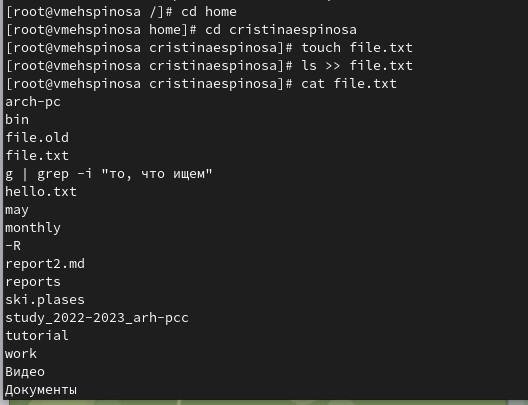{#fig:001 width=70%}

После этого я перешла в каталог /etc и переписала названия фаилов в файл file.txt, с помощью комондой ls /etc >> /home/cristinaespinosa/file.txt. С комондой cat проверила.

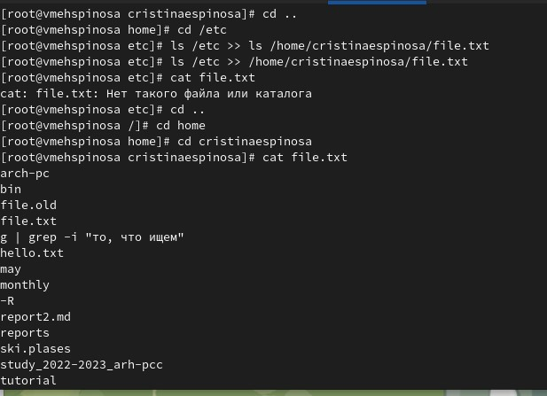{#fig:001 width=70%}

На следующем шаге создайте в домашнем каталоге файл conf.txt и с помощью команды grep.'conf'file.txt найдите в файле file.txt все файлы с расширением .conf.

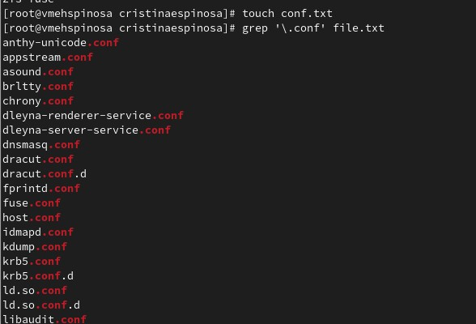{#fig:001 width=70%}

Записалa все файлы в conf.txt командой grep'.conf' file.text>>conf.txt, а с помощью команды cat проверила

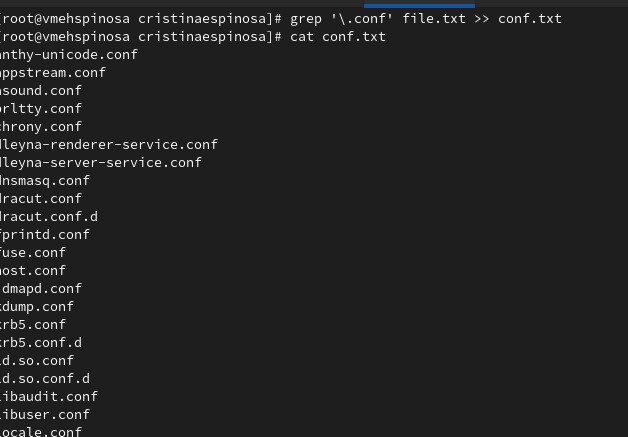{#fig:001 width=70%}

В следующем задании я использовалa команду find -name 'c' -print и нашлa все файлы домашного каталога, которые начинаются с 'c'

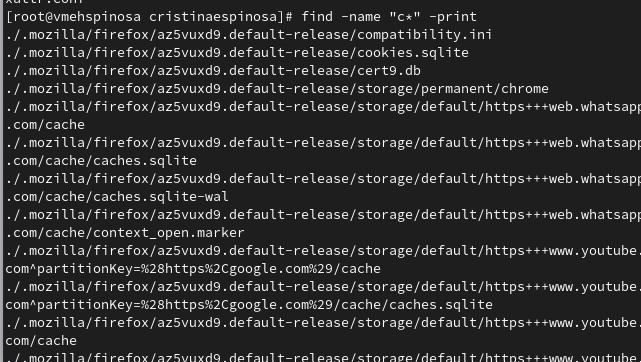{#fig:001 width=70%}

Точно так же ищем его командой ls -R | grep ^с

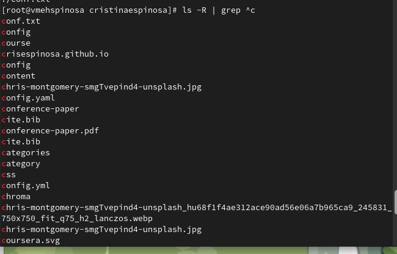{#fig:001 width=70%}

На следующем шаге перейдите в каталог /etc, полистайте свои файлы, имена которых начинаются с команды grep*h. Затем вернитесь в загрузочный каталог и создайте файл logfile, а с помощью команды find -name "log" -print >> logfile запустите фоновый процесс, который записывает все файлы, начинающиеся с "log". Я проверилa это с помощью команды cat. С помощью команды rm я удаляю его

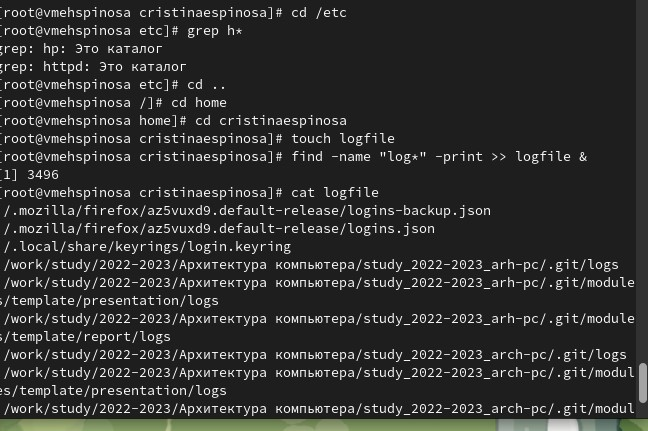{#fig:001 width=70%}

На следующем шаге редактор gedit был запущен в фоновом режиме с помощью команды gedit &

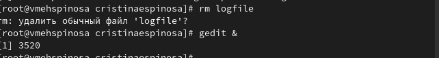{#fig:001 width=70%}

Затем нам нужно было найти идентификатор этого процесса с помощью ps aux |grep gedit.

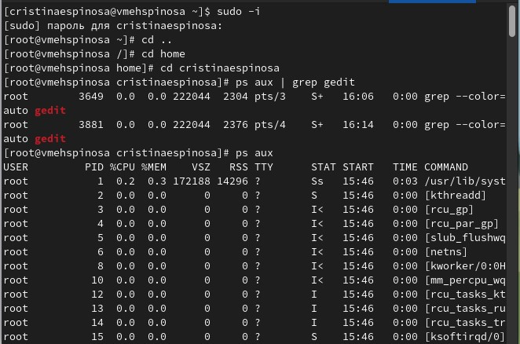{#fig:001 width=70%}

На следующем шаге, используя команду kill, используя man, и я убиваю процесс ранее. Запустите команду df -vi, используя man

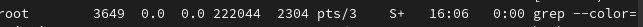{#fig:001 width=70%}

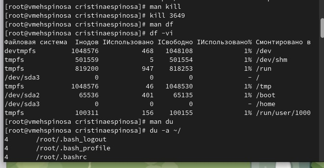{#fig:001 width=70%}

В качестве последнего шага я печатаю все имена каталогов в домашнем каталоге, используя find. В этом случае, используя man, используйте команду find -maxdepth 1

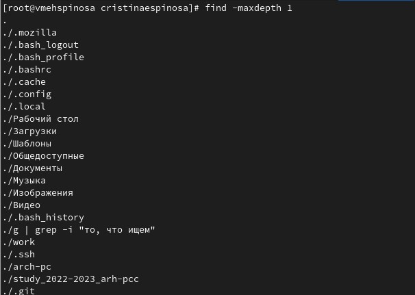{#fig:001 width=70%}

# Выводы

Мы знакомимся с инструментами для поиска файлов и фильтрации текстовых данных и получаем практические навыки управления процессами, проверки использования диска и обслуживания файловых систем.

# Список литературы{.unnumbered}

 1. Какие потоки ввода вывода вы знаете?

В системе по умолчанию открыто три специальных потока:

– stdin — стандартный поток ввода (по умолчанию: клавиатура), файловый дескриптор 0;

– stdout — стандартный поток вывода (по умолчанию: консоль), файловый дескриптор 1;

– stderr — стандартный поток вывод сообщений об ошибках (по умолчанию: консоль), файловый дескриптор 2.

 2. Объясните разницу между операцией > и >>.

    Операция > перезаписывает существующие файлы или создает новые, если файла с указанным именем не существует.
    Операция >> добавляет существующий файл или создает новый, если файл с указанным именем отсутствует.

 3. Что такое конвейер?

Конвейр - способ объединения простых команд или утилит в цепочки, в которых результат работы предыдущей команды передаётся последующей.

 4. Что такое процесс? Чем это понятие отличается от программы?

Процесс - это программа, выполняющаяся в отдельном виртуальном адресном пространстве. По сути, каждый процесс - это экзепляр программы, выполняемой компьютером, а программа - набор инструкци для выполнения какой-то задачи. Процесс, в отличие от программы, живет меньше и требует определенные ресурсы компьютера (память, устройтсво ввода-вывода, процессор)

 5. Что такое PID и GID?

PID (Process ID) - идентификтаор процесса.

GID (Group ID) -идентификатор группы.

6. Что такое задачи и какая команда позволяет ими управлять?

Задачи - запущенные в фоновом ржиме программы. Ими можно управлять с помощью команды jobs.

7. Найдите информацию об утилитах top и htop. Каковы их функции?

top - консольная команда, которая выводит список работающих в системе процессов и информацию о них. По умолчанию она в реальном времени сортирует их по нагрузке на процессор.

htop - аналог top. Она показывает динамический список системных процессов, список обычно выравнивается по использованию ЦПУ. В отличие от top, htop показывает все процессы в системе. Также показывает время непрерывной работы, использование процессоров и памяти.

8. Назовите и дайте характеристику команде поиска файлов. Приведите примеры использования этой команды.

Поиск файлов осущесвляется с помощью команды find. Она может вывести файлы, соответсвующи е заданной строке символов. Синтаксис: find путь [ -опции ]. Путь определяет каталог, начиная с которого по всем подкаталогам будет вестись поиск.

Примеры:

find -name "for*" -print

Данная команда в текущем каталоге найдет файлы, начинающиеся с for и выведет их на экран. Также примеры можно увидеть в выполнении лабораторной работы.

 9. Можно ли по контексту (содержанию) найти файл? Если да, то как?

Можно, это делается с помощью команды grep. Данная команда позволяет найти в текстовом файле указанную строку символов.

 10. Как определить объем свободной памяти на жёстком диске?

Jбъем свободной памяти на жёстком диске можно определить с помощью команды df

 11. Как определить объем вашего домашнего каталога?

Объем домашнего каталога можно определить с помощью команды du

12. Как удалить зависший процесс?

Удалить завиший процесс можно командой kill, указав идентификтаор процесса или командой kilall
