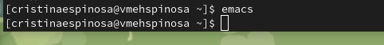
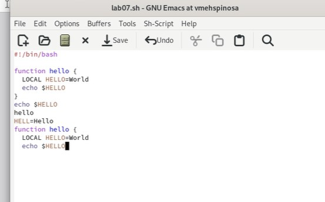

---
## Front matter
title: "Шаблон отчёта по лабораторной работе 9"

author: "Кристина Эспиноса"

## Generic otions
lang: ru-RU
toc-title: "Содержание"

## Bibliography
bibliography: bib/cite.bib
csl: pandoc/csl/gost-r-7-0-5-2008-numeric.csl

## Pdf output format
toc: true # Table of contents
toc-depth: 2
lof: true # List of figures
lot: true # List of tables
fontsize: 12pt
linestretch: 1.5
papersize: a4
documentclass: scrreprt
## I18n polyglossia
polyglossia-lang:
  name: russian
  options:
	- spelling=modern
	- babelshorthands=true
polyglossia-otherlangs:
  name: english
## I18n babel
babel-lang: russian
babel-otherlangs: english
## Fonts
mainfont: PT Serif
romanfont: PT Serif
sansfont: PT Sans
monofont: PT Mono
mainfontoptions: Ligatures=TeX
romanfontoptions: Ligatures=TeX
sansfontoptions: Ligatures=TeX,Scale=MatchLowercase
monofontoptions: Scale=MatchLowercase,Scale=0.9
## Biblatex
biblatex: true
biblio-style: "gost-numeric"
biblatexoptions:
  - parentracker=true
  - backend=biber
  - hyperref=auto
  - language=auto
  - autolang=other*
  - citestyle=gost-numeric
## Pandoc-crossref LaTeX customization
figureTitle: "Рис."
tableTitle: "Таблица"
listingTitle: "Листинг"
lofTitle: "Список иллюстраций"
lotTitle: "Список таблиц"
lolTitle: "Листинги"
## Misc options
indent: true
header-includes:
  - \usepackage{indentfirst}
  - \usepackage{float} # keep figures where there are in the text
  - \floatplacement{figure}{H} # keep figures where there are in the text
---

# Цель работы

Познакомиться с операционной системой Linux. Получить практические навыки рабо-
ты с редактором Emacs

# Задание

2. Ознакомиться с теоретическим материалом.
2. Ознакомиться с редактором emacs.
3. Выполнить упражнения.
4. Ответить на контрольные вопросы

# Выполнение лабораторной работы

Я открыла emacs в терминале

{#fig:001 width=70%}

Потом создала файл lab07.sh с помощью комбинации Ctrl-x Ctrl-f, и ноберила текст из файла. 

{#fig:001 width=70%}
{#fig:001 width=70%}

Сохранить файл с помощью комбинации Ctrl-x Ctrl-s 
Проделать с текстом стандартные процедуры редактирования, каждое действие должно осуществляться комбинацией клавиш.

{#fig:001 width=70%}
Управление буферами.
{#fig:001 width=70%}
Вывести список активных буферов на экран (C-x C-b)
{#fig:001 width=70%}
В каждом из четырёх созданных окон откройте новый буфер (файл) и введите
несколько строк текста. Но мне не открылось четырый окна
{#fig:001 width=70%}

Режим поиска. Переключитесь в режим поиска (C-s) и найдите несколько слов, присутствующих в тексте.
Переключайтесь между результатами поиска, нажимая C-s.
{#fig:001 width=70%}
Выйдите из режима поиска, нажав C-g.
{#fig:001 width=70%}
Перейдите в режим поиска и замены (M-%), введите текст, который следует найти и заменить, нажмите Enter , затем введите текст для замены. После того нажмите ! для подтверждения замены. 
{#fig:001 width=70%}
Испробуйте другой режим поиска, нажав M-s o.

{#fig:001 width=70%}

# Выводы
Мы познакомились с операционной системой Linux и получили практические навыки работы с редактором Emacs.

# Контрольные вопросы

1. Кратко охарактеризуйте редактор emacs.
Emacs представляет собой мощный экранный редактор текста, написанный на языке высокого уровня Elisp.

2. Какие особенности данного редактора могут сделать его сложным для освоения но-
вичком?

Для работы с emacs требуется знать много о его функциях и о том, какими комбинациями клавиш они могут быть вызваны. Этих функций, как и комбинаций соответсвенно, достаточно много. Также сложность могут вызвать несовместимость кнопок вашего ПК и кнопок, заложенных в функциях редактора.

3. Своими словами опишите, что такое буфер и окно в терминологии emacs’а.

Буфер - это область, где пользователь набирает текст или как-то с ней работает, а окно - это область фрейма, в которой отображается этот буфер, либо же объединение буферов.

4. Можно ли открыть больше 10 буферов в одном окне?

Да, можно.

5. Какие буферы создаются по умолчанию при запуске emacs?

'* GNU Emacs *, * Message , scratch *'

6. Какие клавиши вы нажмёте, чтобы ввести следующую комбинацию C-c | и C-c C-|?
Ctrl+c Shift+\ и Ctrl+c Ctrl + Shift+\

7. Как поделить текущее окно на две части?
По вертикали - Ctrl+x 3, по горизонтали - Ctrl+x 2

8. В каком файле хранятся настройки редактора emacs?
Файл Emacs

9. Какую функцию выполняет клавиша и можно ли её переназначить?
Клавиша Backspace выполняет функцию клавиш Ctrl+k и ее можно переназначить.

10. Какой редактор вам показался удобнее в работе vi или emacs? Поясните почему
Несмотря на то, что vi проще в использовании, мне больше понравился Emacs благодаря богатому интерфейсу и множеству разнообразных функций. Текст в нем редактируеся лучше и интерсней.
