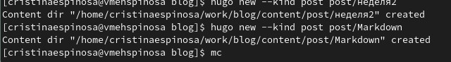
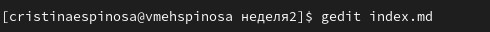
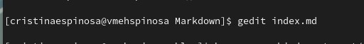
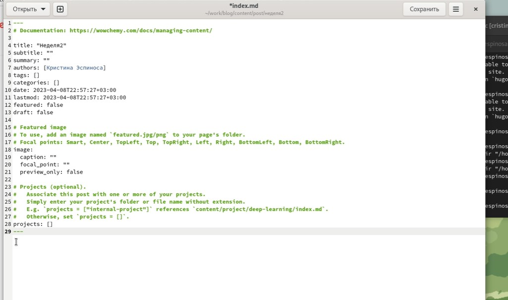
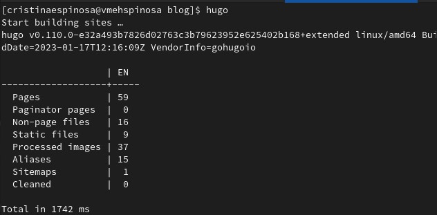
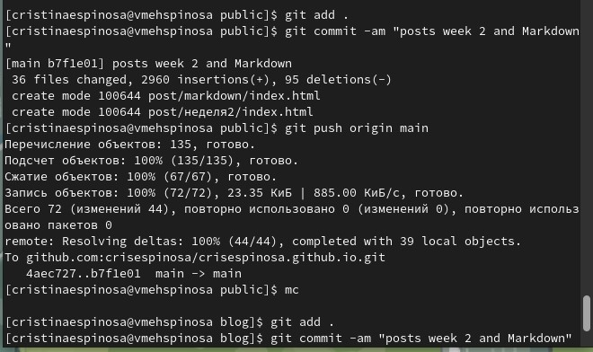
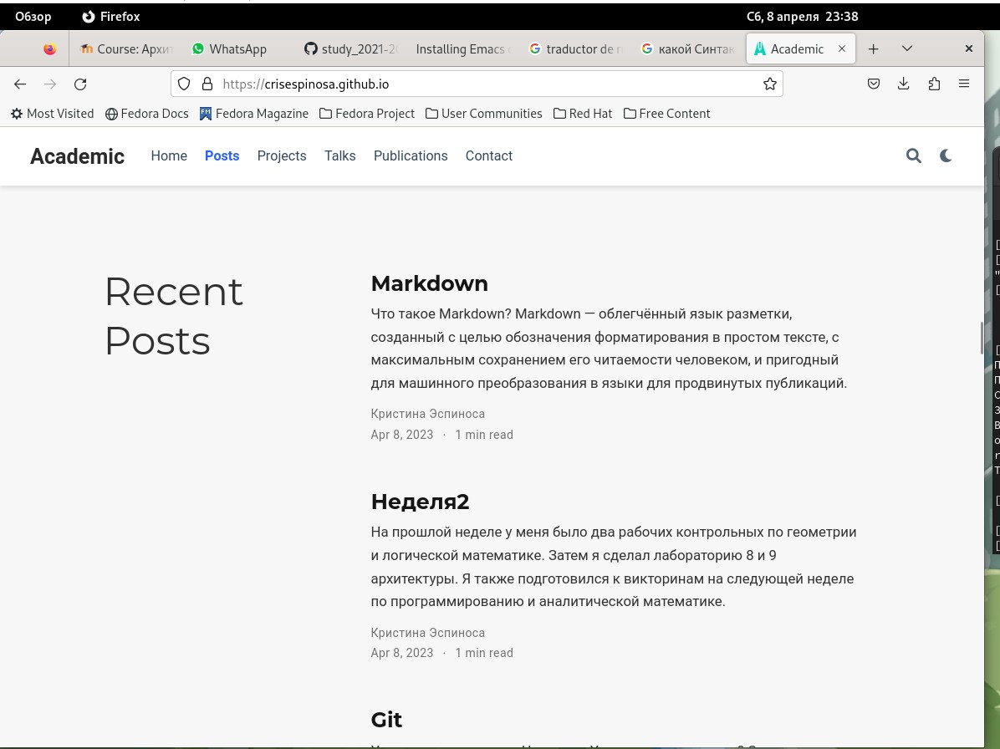

---
## Front matter
title: "Шаблон отчёта по лабораторной работе"
subtitle: "Простейший вариант"
author: "Кристина Эспиноса"

## Generic otions
lang: ru-RU
toc-title: "Содержание"

## Bibliography
bibliography: bib/cite.bib
csl: pandoc/csl/gost-r-7-0-5-2008-numeric.csl

## Pdf output format
toc: true # Table of contents
toc-depth: 2
lof: true # List of figures
lot: true # List of tables
fontsize: 12pt
linestretch: 1.5
papersize: a4
documentclass: scrreprt
## I18n polyglossia
polyglossia-lang:
  name: russian
  options:
	- spelling=modern
	- babelshorthands=true
polyglossia-otherlangs:
  name: english
## I18n babel
babel-lang: russian
babel-otherlangs: english
## Fonts
mainfont: PT Serif
romanfont: PT Serif
sansfont: PT Sans
monofont: PT Mono
mainfontoptions: Ligatures=TeX
romanfontoptions: Ligatures=TeX
sansfontoptions: Ligatures=TeX,Scale=MatchLowercase
monofontoptions: Scale=MatchLowercase,Scale=0.9
## Biblatex
biblatex: true
biblio-style: "gost-numeric"
biblatexoptions:
  - parentracker=true
  - backend=biber
  - hyperref=auto
  - language=auto
  - autolang=other*
  - citestyle=gost-numeric
## Pandoc-crossref LaTeX customization
figureTitle: "Рис."
tableTitle: "Таблица"
listingTitle: "Листинг"
lofTitle: "Список иллюстраций"
lotTitle: "Список таблиц"
lolTitle: "Листинги"
## Misc options
indent: true
header-includes:
  - \usepackage{indentfirst}
  - \usepackage{float} # keep figures where there are in the text
  - \floatplacement{figure}{H} # keep figures where there are in the text
---

# Цель работы

Добавить информацию о навыках, опыте и достижениях. Выложить два поста.

# Задание

    Добавить к сайту достижения.

    Добавить информацию о навыках (Skills).
    Добавить информацию об опыте (Experience).
    Добавить информацию о достижениях (Accomplishments).

    Сделать пост по прошедшей неделе.

    Добавить пост на тему "Язык разметки Markdown."

# Выполнение лабораторной работы
Я не могла найти файлы Skills, поэтому я начила с второй шаги. 

Я перешла к созданию постов. Вначале я создала папки для этих постов. Для этого я открыла solo в терминале и набрала команды hugo new --kind post post/Моя-2-неделя и hugo new --kind post post/Markdown.

{#fig:001 width=70%}

После я открыла файлы и вставила туда пост о прошедшей неделе. Также в папку поста я перенесла нужную картинку и переименовала ее.
Все то же самое я проделала и для второго поста по языку разметки.
{#fig:001 width=70%}

После я перешла в blogs, открыла папку в терминале и набрада команду hugo. 

{#fig:001 width=70%}

Далее перешла в папку public, открыда ее в терминале и набрада три стандартные команды: git add .,git commit -am и giy push origin main. 

{#fig:001 width=70%}

Далее перешла в blog и сделала тоже самое.

{#fig:001 width=70%}

{#fig:001 width=70%}

Последним шагом я обновила сайт и проверила внесенные изменения.

{#fig:001 width=70%}
# Выводы

Мы изменили информацию о навыках, достижениях и опыте и добавили новые посты.

# Список литературы{.unnumbered}

::: {#refs}
:::
