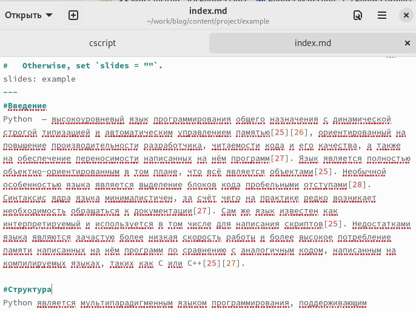
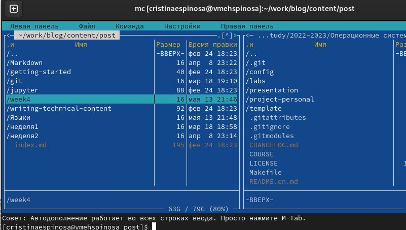
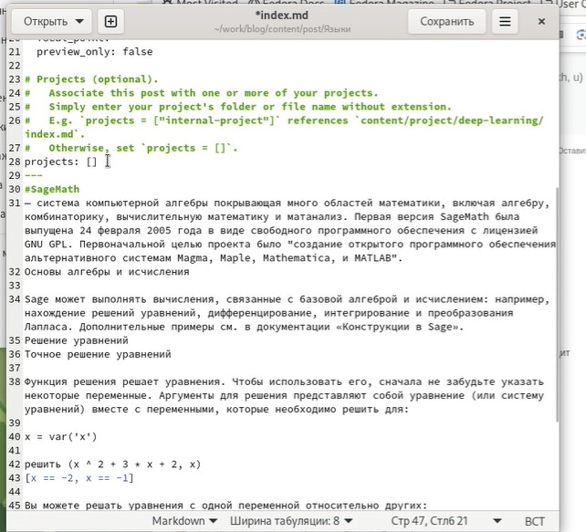
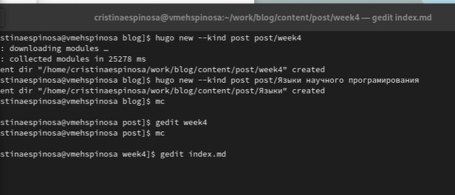
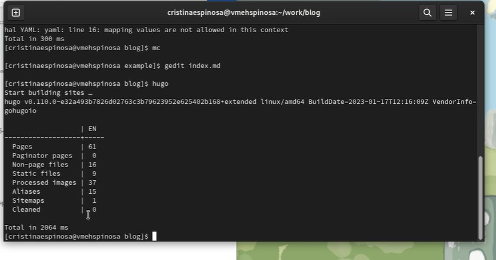
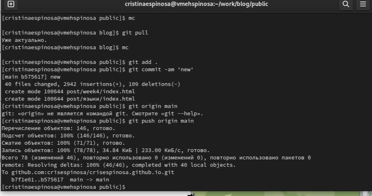

---
## Front matter
lang: ru-RU
title: Пятый этап индивидуального проекта

author:
  - Кристина Эспиноса.
institute:
  - Российский университет дружбы народов, Москва, Россия
 

## i18n babel
babel-lang: russian
babel-otherlangs: english

## Formatting pdf
toc: false
toc-title: Содержание
slide_level: 2
aspectratio: 169
section-titles: true
theme: metropolis
header-includes:
 - \metroset{progressbar=frametitle,sectionpage=progressbar,numbering=fraction}
 - '\makeatletter'
 - '\beamer@ignorenonframefalse'
 - '\makeatother'
---

# Информация

## Докладчик

:::::::::::::: {.columns align=center}
::: {.column width="70%"}

  * Кулябов Дмитрий Сергеевич
  * д.ф.-м.н., профессор
  * профессор кафедры прикладной информатики и теории вероятностей
  * Российский университет дружбы народов
  * [kulyabov-ds@rudn.ru](mailto:kulyabov-ds@rudn.ru)
  * <https://yamadharma.github.io/ru/>

:::
::: {.column width="30%"}

:::
::::::::::::::

# Вводная часть

##Цель работы

Научиться добавлять на сайт записи о персональных проектах.
Задачи

    Сделать записи для персональных проектов.

    Сделать пост по прошедшей неделе.

    Добавить пост на тему "Языки научного программирования".

##Выполнение работы

#Изменение файла projects
я перешла в папку work/solo/content/progects/example и открыла файл, находящийся в ней, в редакторе. Там я изменила всю информацию о проекте, заменив шаблонную запись на свою.

{#fig:001 width=70%}
{#fig:001 width=70%}

#Добавление записей проектов

Открыла в редакторе копированный файл и изменила в нем информацию. Вторая запись называлась "Языки".
{#fig:001 width=70%}

#Создание папок для постов

После я сохранила все изменения, перед этим проверив их на локальном сайте. Затем я перешла к созданию постов. Открыла папку solo в терминале и написала две команды: hugo new --kind post post/week4 - для недельного поста и hugo new --kind post post/Языки научного програмирования - для поста по выбору.
{#fig:001 width=70%}

#Недельный пост

Следующим шагом следовала синхронизация локального и удаленного репозиториев. Перешла в папку solo, открыла ее в терминале и вызвала файл hugo.
{#fig:001 width=70%}

#Синхронизация репозиториев

Далее перешла в папку public и, открыв ее в терминале, набрала стандартные команды: git pull, git add ., git commit -am, git push origin main. Когда все прошло успешно, вернулась в папку solo и повторила действия. 
{#fig:001 width=70%}

Все изменения были добавлены.
{#fig:001 width=70%}

