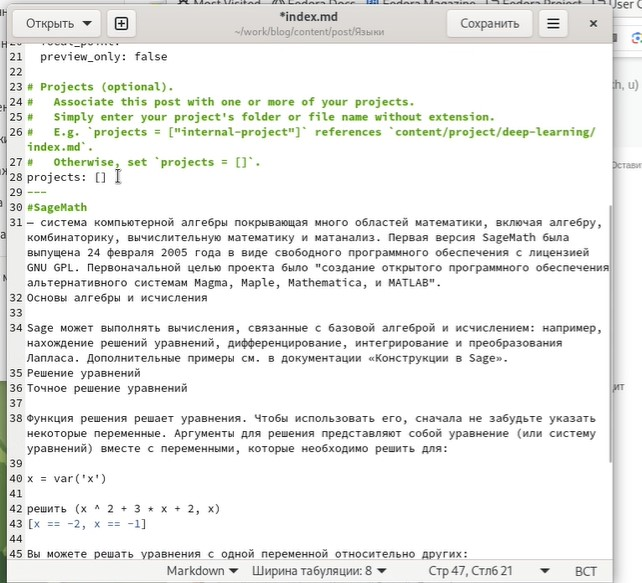

---
## Front matter
title: "Шаблон отчёта по индивидуальному проекту"

author: "Кристина Эспиноса"

## Generic otions
lang: ru-RU
toc-title: "Содержание"

## Bibliography
bibliography: bib/cite.bib
csl: pandoc/csl/gost-r-7-0-5-2008-numeric.csl

## Pdf output format
toc: true # Table of contents
toc-depth: 2
lof: true # List of figures
lot: true # List of tables
fontsize: 12pt
linestretch: 1.5
papersize: a4
documentclass: scrreprt
## I18n polyglossia
polyglossia-lang:
  name: russian
  options:
	- spelling=modern
	- babelshorthands=true
polyglossia-otherlangs:
  name: english
## I18n babel
babel-lang: russian
babel-otherlangs: english
## Fonts
mainfont: PT Serif
romanfont: PT Serif
sansfont: PT Sans
monofont: PT Mono
mainfontoptions: Ligatures=TeX
romanfontoptions: Ligatures=TeX
sansfontoptions: Ligatures=TeX,Scale=MatchLowercase
monofontoptions: Scale=MatchLowercase,Scale=0.9
## Biblatex
biblatex: true
biblio-style: "gost-numeric"
biblatexoptions:
  - parentracker=true
  - backend=biber
  - hyperref=auto
  - language=auto
  - autolang=other*
  - citestyle=gost-numeric
## Pandoc-crossref LaTeX customization
figureTitle: "Рис."
tableTitle: "Таблица"
listingTitle: "Листинг"
lofTitle: "Список иллюстраций"
lotTitle: "Список таблиц"
lolTitle: "Листинги"
## Misc options
indent: true
header-includes:
  - \usepackage{indentfirst}
  - \usepackage{float} # keep figures where there are in the text
  - \floatplacement{figure}{H} # keep figures where there are in the text
---

# Цель работы

Научиться добавлять на сайт записи о персональных проектах.
# Задание

    Сделать записи для персональных проектов.

    Сделать пост по прошедшей неделе.

    Добавить пост на тему "Языки научного программирования".

# Выполнение лабораторной работы

я перешла в папку work/solo/content/progects/example и открыла файл, находящийся в ней, в редакторе. Там я изменила всю информацию о проекте, заменив шаблонную запись на свою.

{#fig:001 width=70%}
{#fig:001 width=70%}

Открыла в редакторе копированный файл и изменила в нем информацию. Вторая запись называлась "Языки".
{#fig:001 width=70%}

После я сохранила все изменения, перед этим проверив их на локальном сайте. Затем я перешла к созданию постов. Открыла папку solo в терминале и написала две команды: hugo new --kind post post/week4 - для недельного поста и hugo new --kind post post/Языки научного програмирования - для поста по выбору.
{#fig:001 width=70%}

Следующим шагом следовала синхронизация локального и удаленного репозиториев. Перешла в папку solo, открыла ее в терминале и вызвала файл hugo.
{#fig:001 width=70%}

Далее перешла в папку public и, открыв ее в терминале, набрала стандартные команды: git pull, git add ., git commit -am, git push origin main. Когда все прошло успешно, вернулась в папку solo и повторила действия. 
{#fig:001 width=70%}

Все изменения были добавлены.
{#fig:001 width=70%}

# Выводы

Мы научились добавлять на сайт записи персональнх проектов и добавили на сайт два поста: недельный и по выбору.

# Список литературы{.unnumbered}

::: {#refs}
:::
